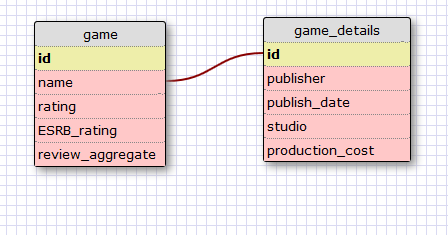
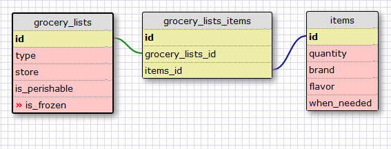

This is a one to one relationship as game_details uses name from game for its unique id.

What is a one-to-one database?
-A one-to-one database is a database where two items have a direct, singular, relationship 
with each other 

When would you use a one-to-one database? (Think generally, not in terms of the 
example you created).
-A one_to_one database is useful when the thing being referred to could be left without
a value.

What is a many-to-many database?
-A many-to-many database is a database in which many items have a relationship to 
many other items such as the potential for the many pets of a family to have all members 
of the family as owners.  

When would you use a many-to-many database? (Think generally, not in terms of the 
example you created).
-A many-to-many database is used when many items which share a relationship with 
many other items. see above for example.  

What is confusing about database schemas? What makes sense?
-I found it all to be rather straightforward and sensical. The examples given
could have been better. 